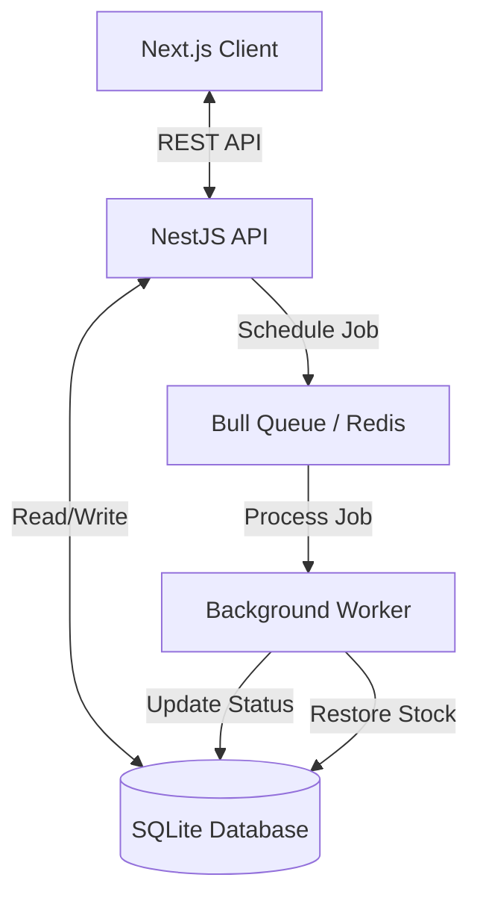

# System Architecture

## Overview

The Flash Sale Stock Reservation System is designed to handle high-concurrency product reservations with strict inventory controls and automatic expiration. The system uses a distributed architecture with NestJS for the backend, Next.js for the frontend, and Redis-based job queues for background processing.

## 🏗️ System Design

### Component Diagram



### Key Components

1. **API Server (NestJS)**
   - Handles HTTP requests
   - Manages business logic
   - Enforces validation
   - Orchestrates transactions

2. **Database (SQLite)**
   - Stores products and reservations
   - Enforces data integrity
   - Manages atomic stock updates

3. **Job Queue (Bull + Redis)**
   - Handles delayed tasks (reservation expiration)
   - Decouples background processing from request lifecycle
   - Ensures reliability even if server restarts

4. **Frontend (Next.js)**
   - Provides real-time user interface
   - Manages local state and timers
   - Polls for stock updates

## 🔄 Concurrency Handling

Handling multiple users trying to reserve the same product simultaneously is the most critical part of this system. We use a combination of strategies:

### 1. Database-Level Atomicity
Instead of a "read-modify-write" pattern which is prone to race conditions, we use atomic SQL updates:

```typescript
// BAD (Race Condition Vulnerable)
const product = await repo.findOne(id);
if (product.stock >= quantity) {
  product.stock -= quantity;
  await repo.save(product);
}

// GOOD (Atomic Update)
const result = await repo.createQueryBuilder()
  .update(Product)
  .set({ availableStock: () => `availableStock - ${quantity}` })
  .where("id = :id", { id })
  .andWhere("availableStock >= :quantity", { quantity }) // Constraint check in query
  .execute();
```

This ensures that the database itself prevents stock from going negative, regardless of how many concurrent requests are hitting the API.

### 2. Database Transactions
All reservation operations are wrapped in transactions. If any part of the process fails (e.g., creating the reservation record or scheduling the expiration job), the entire operation is rolled back, ensuring data consistency.

### 3. Optimistic Locking (Implicit)
By using the `affected` row count from the update query, we effectively implement optimistic locking. If the update affects 0 rows, we know the stock was insufficient (or product didn't exist) at that exact moment, and we reject the request.

## ⏱️ Expiration Mechanism

The expiration system is designed to be robust and independent of client-side interaction.

### Workflow
1. **Reservation Created**: 
   - Stock deducted immediately.
   - Expiration job scheduled in Bull queue with a 2-minute delay.
   
2. **Waiting Period**:
   - Job sits in Redis until delay time is reached.
   - Client shows countdown timer.

3. **Expiration Trigger**:
   - **Scenario A: User Completes Purchase**
     - Reservation status updated to `COMPLETED`.
     - When background job runs later, it checks status. Since it's `COMPLETED`, it does nothing.
   
   - **Scenario B: User Does Nothing**
     - Background job runs after 2 minutes.
     - Checks status (still `ACTIVE`).
     - Updates status to `EXPIRED`.
     - Atomically increments product stock to restore it.

### Why this approach?
- **Reliability**: Redis persists jobs. If the server crashes, jobs are processed when it comes back up.
- **Independence**: Doesn't rely on the user keeping the browser open.
- **Scalability**: Background workers can be scaled independently of the API server.

## 💾 Database Schema

### Products Table
| Column | Type | Description |
|--------|------|-------------|
| id | Integer (PK) | Unique identifier |
| name | Varchar | Product name |
| price | Decimal | Product price |
| availableStock | Integer | Current available inventory |

### Reservations Table
| Column | Type | Description |
|--------|------|-------------|
| id | Integer (PK) | Unique identifier |
| productId | Integer (FK) | Reference to Product |
| quantity | Integer | Amount reserved |
| status | Enum | ACTIVE, COMPLETED, EXPIRED |
| createdAt | Timestamp | When reservation was made |
| expiresAt | Timestamp | When reservation expires |

## ⚖️ Trade-offs and Limitations

### 1. Polling vs. WebSockets
- **Decision**: Used Polling (every 3s) for frontend updates.
- **Reason**: Simpler to implement and sufficient for this scale.
- **Trade-off**: Slight delay in stock updates for users; higher server load than WebSockets at scale.
- **Future Improvement**: Implement Socket.io for real-time stock pushes.

### 2. SQLite vs. PostgreSQL
- **Decision**: Used SQLite.
- **Reason**: Zero-configuration setup, easy for evaluation.
- **Trade-off**: Not suitable for high-scale distributed deployments (file locking issues).
- **Future Improvement**: Switch to PostgreSQL for production.

### 3. Client-Side Timers
- **Decision**: Calculated based on server timestamp (`expiresAt`).
- **Reason**: Ensures synchronization even if client clock is wrong.
- **Limitation**: Slight drift possible due to network latency.

### 4. Mock Payment
- **Decision**: Simple status update.
- **Reason**: Out of scope for this assessment.
- **Future Improvement**: Integrate Stripe/PayPal webhooks.

## 🔒 Security Considerations

- **Input Validation**: All inputs validated using `class-validator` (positive numbers, min quantities).
- **CORS**: Configured to allow only the frontend origin.
- **Parameter Tampering**: IDs validated as integers.
